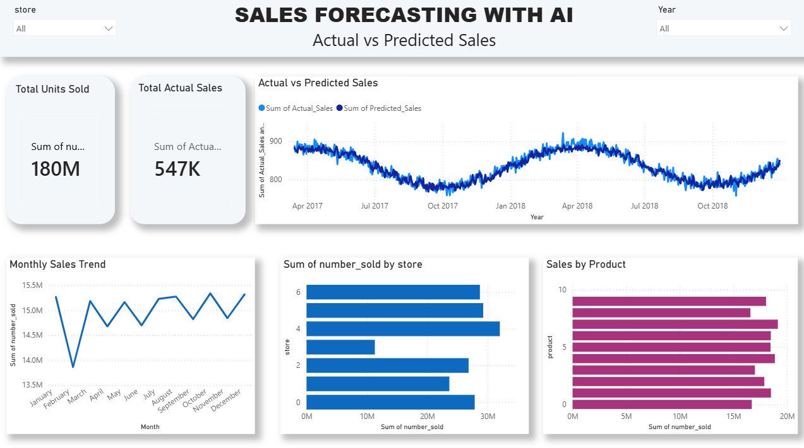

# Sales Forecasting with AI

AI-powered sales forecasting and data analysis project using Python, Machine Learning, and Power BI to analyze sales trends, evaluate store and product performance, and predict sales.

## 📌 Project Overview

This project focuses on analyzing historical sales data and building a machine learning model to forecast sales.

The project combines:

- Exploratory Data Analysis (EDA)
- Sales trend analysis
- Store-wise sales analysis
- Product-wise sales analysis
- Year-wise sales analysis
- Machine Learning-based sales prediction
- Actual vs Predicted sales comparison
- Interactive Power BI dashboard

## 🎯 Objectives

- Analyze historical sales performance
- Identify monthly and yearly sales trends
- Compare sales performance across stores
- Analyze product-wise sales performance
- Calculate year-over-year sales growth
- Build machine learning models for sales forecasting
- Compare actual sales with predicted sales
- Create an interactive Power BI dashboard for business insights

## 🛠️ Technologies Used

### Programming & Data Analysis

- Python
- Pandas
- NumPy
- Matplotlib
- Seaborn

### Machine Learning

- Scikit-learn
- Linear Regression
- Random Forest Regressor
- StandardScaler
- Lag-based Features
- Mean Absolute Percentage Error (MAPE)

### Business Intelligence & Visualization

- Microsoft Power BI
- Matplotlib
- Seaborn

### Tools

- Jupyter Notebook
- Git
- GitHub
- VS Code

## 📊 Exploratory Data Analysis

The project includes analysis of historical sales data to understand business performance and identify important sales patterns.

### Monthly Sales Trend

Analyzed monthly sales to identify trends and changes in sales performance over time.

### Year-wise Sales Analysis

Analyzed total sales for each year and calculated year-over-year sales growth.

### Store-wise Sales Analysis

Compared total sales across different stores to identify high-performing and low-performing stores.

### Product-wise Sales Analysis

Analyzed product-level sales performance and identified products with higher sales volumes.

## 🤖 Machine Learning

Lag-based features were created using previous sales values:

- Lag 1
- Lag 2
- Lag 3

These features were used to predict sales based on historical sales patterns.

### Random Forest Regressor

A Random Forest regression model was trained using historical sales data and lag-based features.

### Linear Regression

A Linear Regression model was also trained to compare forecasting performance.

### Model Evaluation

The models were evaluated using **Mean Absolute Percentage Error (MAPE)**.

The forecasting models were compared based on their prediction performance.

## 📈 Actual vs Predicted Sales

The project compares actual sales with machine learning predictions to evaluate how closely the model follows real sales patterns.

The forecasting dataset contains:

- Date
- Actual Sales
- Predicted Sales

## 📊 Power BI Dashboard

An interactive Power BI dashboard was created to visualize sales performance and forecasting results.

### Dashboard Features

- Total Units Sold
- Total Actual Sales
- YoY Sales Growth %
- Year Slicer
- Monthly Sales Trend
- Year-wise Total Sales
- Sales by Store
- Sales by Product
- Actual vs Predicted Sales

### Dashboard Preview



## 📁 Project Structure

```text
Sales_Forecasting_with_AI/
│
├── Sales.pbix
├── Sales_Forecasting_Dashboard_Image.png
├── Sales_Forecasting_with_Machine_Learning.ipynb
├── sales_forecasting_with_machine_learning.py
├── sales_forecast_powerbi.csv
├── sales_powerbi.csv
├── sales_predictions.csv
├── train.csv
├── test.csv
└── README.md
```

## 🚀 How to Run

### 1. Clone the Repository

```bash
git clone https://github.com/SejalHadole/Sales_Forecasting_with_AI.git
```

### 2. Navigate to the Project Folder

```bash
cd Sales_Forecasting_with_AI
```

### 3. Install Required Libraries

```bash
pip install pandas numpy matplotlib seaborn scikit-learn
```

### 4. Run the Jupyter Notebook

Open the following notebook:

```text
Sales_Forecasting_with_Machine_Learning.ipynb
```

Run the notebook using Jupyter Notebook or JupyterLab.

### 5. Open the Power BI Dashboard

Open:

```text
Sales.pbix
```

using Microsoft Power BI Desktop.

## 📌 Key Outcomes

- Performed sales data analysis using Python.
- Analyzed monthly and yearly sales trends.
- Compared store-wise and product-wise sales performance.
- Created lag-based features for sales forecasting.
- Trained Linear Regression and Random Forest regression models.
- Evaluated model performance using MAPE.
- Generated actual and predicted sales data.
- Created an interactive Power BI dashboard.
- Visualized actual vs predicted sales.
- Created business-focused sales performance insights.

## 🔮 Future Scope

- Implement advanced time-series forecasting models such as ARIMA, Prophet, or XGBoost.
- Forecast sales for multiple stores and products simultaneously.
- Add automated future sales forecasting.
- Deploy the forecasting model as a web application.
- Integrate real-time sales data.
- Add additional business KPIs and advanced Power BI analytics.

## 👩‍💻 Author

**Sejal Hadole**

GitHub: https://github.com/SejalHadole

---

⭐ If you find this project useful, consider giving the repository a star!
